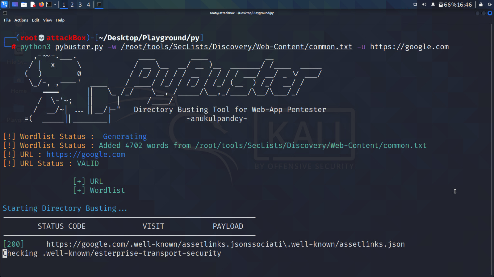

# PyBuster

A directory busting tool for web application penetration tester, written in python. Supports custom wordlist,recursive search.

## Screenshots



  
## Pre Requisites

Python Installed

```bash
version > 3.0
```

## Run Locally
```bash
git clone https://github.com/anukulpandey/pybuster
cd pybuster
python3 pybuster.py -w [WORDLIST LOCATION] -u [WEBSITE URL]
```
## Spawn help
```bash
python3 pybuster.py -h/--help
```

## Authors

- [@anukulpandey](https://www.github.com/anukulpandey)

  
